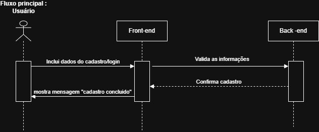
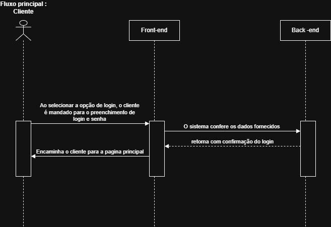
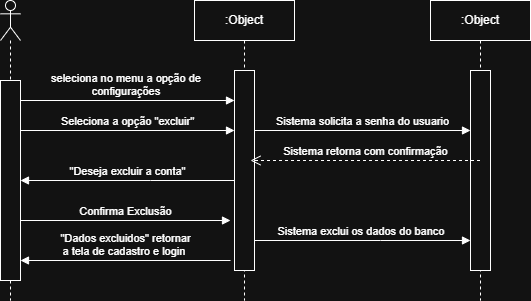
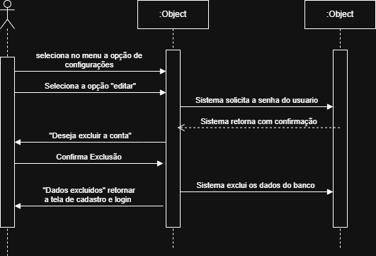
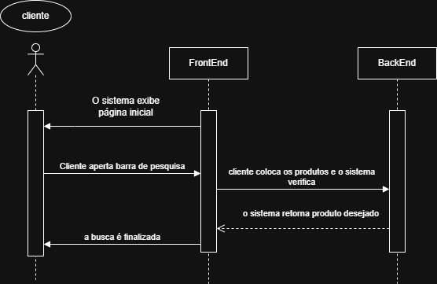
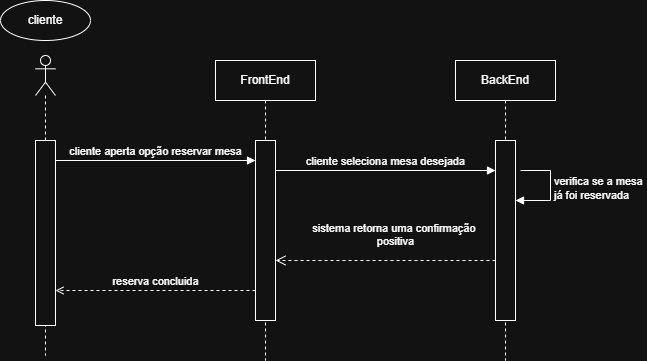
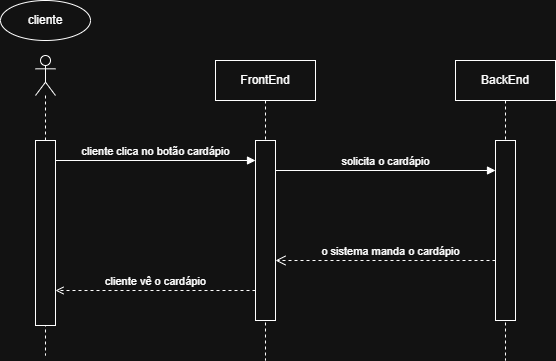
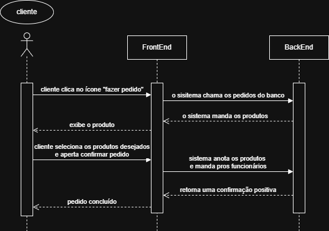
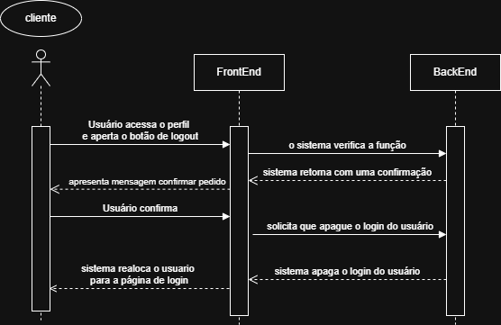

# Casos de Uso:

## Caso de uso 1: Cadastro do cliente.

## Ator: 
- cliente

### Fluxo principal:
- O cliente seleciona a opção “Criar conta”.

- O sistema leva o cliente até a tela de registro contendo um formulário.

- O cliente preenche os campos do formulário (informando e-mail e criando uma senha).

- O sistema consulta o banco de dados para verificar a disponibilidade das informações fornecidas.

- O banco de dados retorna uma confirmação positiva.

- O sistema realiza o cadastro, salvando os dados do novo cliente.

- O sistema encaminha o cliente para a página principal do site.

### Fluxo alternativo A: O email já está cadastrado
-   O cliente seleciona a opção “Criar conta”.
    
-   O sistema leva o cliente até a tela de registro contendo um formulário.
    
-   O cliente preenche os campos do formulário (informando e-mail e criando uma senha).
    
-   O banco de dados retorna que o email informado já está em uso.

### Fluxo Alternativo B: Campo vazio
- O cliente seleciona a opção “Criar conta”.
  
- O sistema leva o cliente até a tela de registro contendo um formulário.
  
- O cliente não preenche um dos campos e clica no botão de "Criar Conta".
  
- O sistema analisa os campos de cadastro e pede que o cliente preencha todos os campos.

### Fluxo Alternativo C: Senha diferente dos padrões exigidos
- O cliente seleciona a opção “Criar conta”.
  
- O sistema leva o cliente até a tela de registro contendo um formulário.
  
- O cliente insere uma senha.
  
- O sistema analisa se a senha está dentro dos padrões exigidos (mínimo 8 caracteres e 1 símbolo)
  
- O sistema exibe uma mensagem de erro e informa ao cliente que a senha está fora dos padrões.
  
- O sistema exibe uma mensagem sugerindo que o cliente coloque a senha correta.
  
- O sistema registra as informações no banco de dados e informa cliente.

## Caso de Uso 2: Login do cliente.

## Ator:
- cliente

### Fluxo principal:
- O cliente seleciona a opção "Login".

- O sistema leva o cliente até a tela de preenchimento de senha e email.

- cliente preenche os campos da tela.

- O sistema consulta o banco de dados para a confirmação dos dados inseridos.

- O banco de dados retorna uma confirmação positiva.

- O sistema encaminha o cliente para a página principal do site.

### Fluxo Alternativo A: Email inválido
- O cliente seleciona a opção "Login".

- O sistema leva o cliente até a tela de preenchimento de senha e email.

- cliente preenche os campos da tela.

- O sistema consulta o banco de dados.

- O banco de dados retorna que o email informado já está em uso.
  
- O sistema exibe uma mensagem dizendo que o email está inválido e sugere que o cliente digite outro email.

### Fluxo alternativo B: senha inválida
- O cliente seleciona a opção "Login".

- O sistema leva o cliente até a tela de preenchimento de senha e email.

- cliente preenche os campos da tela.

- O sistema consulta o banco de dados.

- O banco de dados retorna que a senha informada já está em uso.
  
- O sistema exibe uma mensagem dizendo que a senha está inválida e sugere que o cliente digite outra senha.

### Fluxo alternativo C: campo vazio
- O cliente seleciona a opção "Login".

- O sistema leva o cliente até a tela de preenchimento de senha e email.

- O cliente não preenche um dos campos e clica no botão de "Login".

- O sistema analisa os campos de cadastro e pede que o usuário preencha todos os campos.

## Caso de Uso 3: Excluir conta.

## Ator:
- cliente 

### Fluxo principal:
- O cliente acessa o menu do seu perfil com as configurações da sua conta.

- O cliente aperta o botão excluir conta.

- O sistema solicita a senha do cliente para proseguir com a exclusão.

- O cliente digita a senha.

- O sistema analisa a veracidade da senha no banco de dados.

- O banco de dados retorna uma confirmação positiva.

- O sistema pergunta se quer confirmar a exclusão.

- O cliente aperta o botão confirmar.

- O sistema apaga os dados do cliente no banco de dados.

- O sistema apresenta mensagem de sucesso.

- O sistema realoca o cliente para a página de login e cadastro.

### Fluxo Alternativo A: senha inválida
- O cliente acessa o menu do seu perfil com as configurações da sua conta.

- O cliente aperta o botão excluir conta.

- O sistema solicita a senha do cliente para proseguir com a exclusão.

- - O cliente digita a senha incorreta.

- O sistema analisa a veracidade da senha no banco de dados.

- O banco de dados retorna uma confirmação negativa.

- O sistema apresenta mensagem de senha inválida

### Fluxo Alternativo B: Campo vazio
- O cliente acessa o menu do seu perfil com as configurações da sua conta.

- O cliente aperta o botão excluir conta.

- O sistema solicita a senha do cliente para proseguir com a exclusão.

- O cliente não preenche o campo e aperta no botão de excluir.

- O sistema analisa o campo e pede que o cliente informe uma senha.

### Fluxo Alternativo C: cancelar exclusão
- O cliente acessa o menu do seu perfil com as configurações da sua conta.

- O cliente aperta o botão excluir conta.

- O sistema solicita a senha do cliente para proseguir com a exclusão.

- O cliente digita a senha.

- O sistema analisa a veracidade da senha no banco de dados.

- O banco de dados retorna uma confirmação positiva.

- O sistema pergunta se quer confirmar a exclusão.

- O cliente aperta o botão de cancelar.

- O sistema realoca o cliente para o menu do perfil.

## Caso de Uso 4: Editar dados de cadastro.

## Ator:
- cliente

### Fluxo principal:
- O cliente acessa o menu do seu perfil com as configurações da sua conta.

- O cliente aperta o botão "editar dados de cadastro da conta".

- O sistema exibe os dados de cadastro do cliente.

- O cliente edita dados do seu cadastro e aperta o botão confirmar.

- O sistema edita os dados do cliente no banco de dados.

- O sistema mando o cliente pra tela principal.

### Fluxo Alternativo A: cancelar edição
- O cliente acessa o menu do seu perfil com as configurações da sua conta.

- O cliente aperta o botão "editar dados de cadastro da conta".

- O sistema exibe os dados de cadastro do cliente.

- O cliente edita dados do seu cadastro e aperta o botão cancelar.

- O sistema realoca o cliente para o menu do perfil.

### Fluxo Alternativo B: Campo Vazio
- O cliente acessa o menu do seu perfil com as configurações da sua conta.

- O cliente aperta o botão "editar dados de cadastro da conta".

- O sistema exibe os dados de cadastro do cliente.

- O cliente edita e apaga os dados do seu cadastro e aperta o botão confirmar.

- O sistema analisa os campos e pede que o cliente informe os novos dados.

## Caso de Uso 5: Busca de produtos.

## Atores:
- cliente

### Fluxo principal:
- O sistema apresenta a página inicial do site.

- O cliente aperta na barra de pesquisa.

- O cliente digita o nome do Produto que deseja.

- O cliente aperta no botão "Enter".

- O sistema consulta o banco de dados.

- O banco retorna a Produto desejada.

- A busca é finalizada.

### Fluxo Alternativo A: Produto Inexistente
- O sistema apresenta a página inicial do site.

- O cliente aperta na barra de pesquisa.

- O cliente digita o nome do Produto que deseja.

- O cliente aperta no botão "Enter".

- O sistema consulta o banco de dados.

- O banco informa que o produto não exite.

### Fluxo Alternativo B: Campo Vazio
- O sistema apresenta a página inicial do site.

- O cliente aperta na barra de pesquisa.

- O cliente não preenche o campo.

- O cliente aperta no botão "Enter".

- O sistema consulta o banco de dados.

- O banco analisa e pede que o cliente digite o produto que deseja.

## Caso de Uso 6: Reserva de mesa.

## Atores:
- cliente

### Fluxo principal:
- O cliente clica na opção "reserva mesa".

- O cliente seleciona a mesa desejada.

- O sistema verifica se a mesa ja foi reservada.

- O sistema retorna com uma confirmação positiva.

- Reserva concluida.

### Fluxo Alternativo A: Mesa indisponível
- O cliente clica na opção "reserva mesa".

- O cliente seleciona a mesa desejada.

- O sistema verifica se a mesa ja foi reservada.

- O sistema retorna com uma confirmação negativa.

- O sistema apresenta uma mensagem dizendo que a mesa selecionada já está resrvada.

## Caso de Uso 7: ver cardápio.

## Atores:
- Cliente

### Fluxo principal:
 O cliente clica no botão "cardápio".

- O sistema vai colocar o cardápio na tela.

- Cliente vê o cardápio.

## Caso de Uso 8: Fazer pedido.

## Atores:
- cliente

### Fluxo principal:
- O cliente clica no ícone do "fazer pedido".

- O cliente seleciona os produtos desejados.

- o cliente aperta no botão "confirmar pedido".

- O sistema anota os produtos selecionados.

- O sitema manda pros funcionarios.

- O sistema retorna com a confirmação positiva.

- O pedido foi concluido.

### Fluxo Alternativo: A: Nenhum produto selecionado
- O cliente clica no ícone do "fazer pedido".

- O cliente não seleciona os produtos.

- o cliente aperta no botão "confirmar pedido".

- O sistema informa que o cliente deve selecionar algum produto.

### Fluxo Alternativo: B: Cancelar pedido
- O cliente clica no ícone do "fazer pedido".

- O cliente não seleciona os produtos.

- o cliente aperta no botão "Cancelar".

- O sistema cancela o pedido redireciona o cliente para a página principal.

## Caso de Uso 9: Logout

## Atores:
- cliente

### Fluxo principal:
- O usuário acessa o menu do seu perfil com as configurações da sua conta e aperta o botão de "Logout".

- O sistema apresenta uma mensagem perguntando "Quer confirmar o Logout?".

- O usuário confirma.

- O sistema apaga o login do usuário.

- O sistema realoca o usuário para a página de login.

### Fluxo Alternativo A: Cancelar Logout
- O usuário acessa o menu do seu perfil com as configurações da sua conta e aperta o botão de "Logout".

- O sistema apresenta uma mensagem perguntando "Quer confirmar o Logout?".

- O usuário aperta cancelar.

## Caso de Uso 10: Gerenciar pedido

## Atores:
- funcionario

### Fluxo principal:
- O funcionario recebe uma mensagem do sistema dizendo que o pedido foi feito.

- Funcionario retorna pro sistema a mensagem "pedido em andamento".

## Caso de Uso 11: Gerenciar funcionario.

## Atores:
- Administrador

### Fluxo principal:
- O administrador acessa o sistema.

- Seleciona a opção "funcionarios".

- Visualiza a lista de funcionarios.

- Clica em "Adicionar funcionario".

- Preenche as informações do funcionario(nome, foto, serviço, gmail e senha).

- Clica em "Salvar funcinario".

- O sistema adiciona o novo funcionario ao sistema.

### Fluxo Alternativo A: Funcionário já existente
- - O administrador acessa o sistema.

- Seleciona a opção "funcionarios".

- Visualiza a lista de funcionarios.

- Clica em "Adicionar funcionario".

- Preenche as informações do funcionario(nome, foto, serviço, gmail e senha).

- Clica em "Salvar funcinario".

- O sistema verifica e informa que o funcionário cadastrado já existe.

### Fluxo Alternativo B: Campo vazio
- O administrador acessa o sistema.

- Seleciona a opção "funcionarios".

- Visualiza a lista de funcionarios.

- Clica em "Adicionar funcionario".

- O cliente não preenche as informações do funcionario(nome, foto, serviço, gmail e senha).

- Clica em "Salvar funcinario".

- O  sistema verifica e diz que as informações devem ser preenchidas

### Fluxo Alternativo C: Cancelar
- O administrador acessa o sistema.

- Seleciona a opção "funcionarios".

- Visualiza a lista de funcionarios.

- Clica em "Adicionar funcionario".

- Preenche as informações do funcionario(nome, foto, serviço, gmail e senha).

- Clica em "Cancelar".

- O sistema redireciona o administrador para o sistema.

## Caso de Uso 12: Gerenciar clientes.

## Atores:
- Administrador

### Fluxo principal:
- O administrador acessa o sistema.

- O administrador vai até a seção "clientes".

- O administrador visualiza a lista de clientes cadastrados.

- O administrador clica sobre um cliente para ver detalhes.

- O administrador pode optar por editar ou excluir o cadastro do cliente.

### Fluxo Alternativo A: Nenhum cliente cadastrado
- O administrador acessa a seção “Clientes”.
- O sistema verifica que não existem clientes cadastrados.
- O sistema exibe uma mensagem informando que não há clientes registrados.
